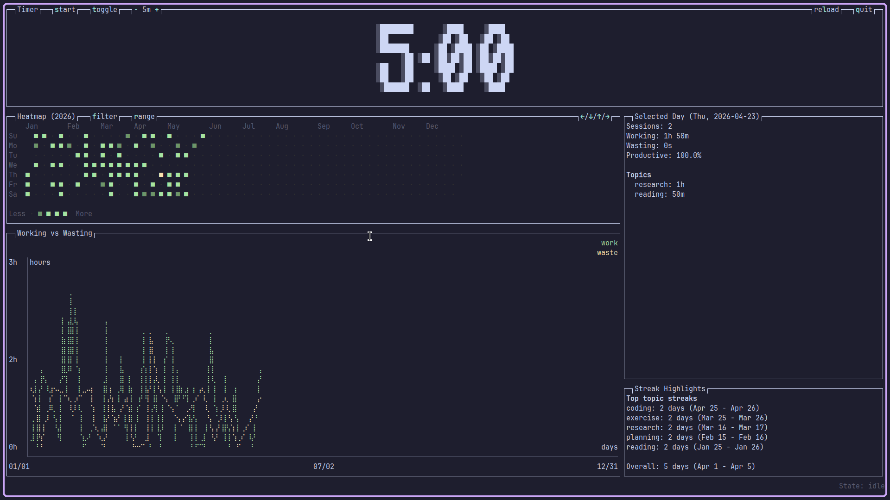

# TaskBeep - Pomodoro Timer

A Pomodoro timer with productivity tracking that plays a beep sound at the end
of each interval.

## Features

- Start timer with a custom topic and interval
- Receive beep notification when timer completes
- Signal whether you were working or wasting time
- Track productivity statistics by topic
- Integration-friendly (designed for use with Waybar or other status bars)
- Run custom scripts on timer finish (for notifications, popups, automation)

## Usage

### Start a Pomodoro Session

```bash
# Default 25-minute (1500s) session
taskbeep start "Writing documentation"

# Custom interval (e.g., 45 minutes)
taskbeep start "Deep work coding" 2700
```

The timer will:

1. Run in the background for the specified interval
2. Play a beep sound when the interval completes
3. Wait for your response about how productive you were

### Respond to Timer

When the timer beeps, signal whether you were productive:

```bash
# Signal that you were working on the task
taskbeep working

# Signal that you were wasting time
taskbeep wasting
```

### Check Status

```bash
# Human-readable format (default)
taskbeep status

# JSON format (for scripting)
taskbeep status --format json

# Plain key=value format (for parsing)
taskbeep status --format plain
```

Shows:

- Current status (running/paused/waiting)
- Current topic
- Interval length
- Sessions completed
- Time remaining
- Whether waiting for working/wasting response

The `--format` flag supports three output formats:

- `human` (default): Human-readable multi-line output
- `json`: Structured JSON for easy parsing in scripts
- `plain`: Simple key=value pairs, one per line

### View Statistics

```bash
taskbeep stats
```

Shows:

- Total sessions (working vs wasting)
- Overall productivity percentage
- Breakdown by topic with individual productivity rates

### Stop Timer

```bash
taskbeep stop
```

### Interactive Terminal UI

TaskBeep includes an optional interactive terminal user interface (TUI) powered
by `ratatui` and `crossterm`. The TUI is feature-gated behind the `ui` Cargo
feature and must be built with that feature enabled.



Basic usage:

```bash
# Launch the TUI (requires a build with the `ui` feature enabled)
taskbeep ui
```

Common keys inside the TUI (highlighted):

- `q` / `Esc`: quit the UI
- Arrow keys to navigate the heatmap
- `f`: open topic filter input
- `r`: open range input
- `s`: start a new timer
- `t`: pause/resume toggle
- `+` / `-`: adjust pending interval when timer not running

See the `examples/` scripts for sample on-beep integrations used with the UI.

## Integration with Waybar

You can integrate this with Waybar to create a visual Pomodoro timer. Here's an
example configuration:

### Waybar Config (`~/.config/waybar/config`)

```json
{
  "custom/pomodoro": {
    "exec": "~/.config/waybar/scripts/pomodoro.sh",
    "return-type": "json",
    "interval": 1,
    "format": "󰔛 {text}",
    "escape": false,
    "tooltip": false,
    "on-click": "~/.config/waybar/scripts/pomodoro.sh working",
    "on-click-middle": "~/.config/waybar/scripts/pomodoro.sh toggle",
    "on-click-right": "~/.config/waybar/scripts/pomodoro.sh wasting"
  }
}
```

### Pomodoro script (`~/.config/waybar/scripts/pomodoro.sh`)

```bash
#!/usr/bin/env bash
export PATH="$HOME/.cargo/bin:$PATH"

cmd="$1"

if [[ -n "$cmd" ]]; then
    case "$cmd" in
    working)
        taskbeep working
        exit 0
        ;;
    toggle)
        taskbeep toggle
        exit 0
        ;;
    wasting)
        taskbeep wasting
        exit 0
        ;;
    *)
        echo "Unknown command"
        exit 1
        ;;
    esac
fi

raw=$(taskbeep status --format plain 2>/dev/null)

if [[ $? -ne 0 ]] || [[ -z "$raw" ]]; then
    echo '{"text":"Idle", "class":"idle"}'
    exit 0
fi

status=""
remaining_seconds=0

while IFS='=' read -r key value; do
    case "$key" in
    status)
        status="$value"
        ;;
    remaining_seconds)
        remaining_seconds="$value"
        ;;
    esac
done <<<"$raw"

case "$status" in
running)
    minutes=$((remaining_seconds / 60))
    seconds=$((remaining_seconds % 60))
    text=$(printf "%02d:%02d" "$minutes" "$seconds")
    class="running"
    ;;
paused)
    text="Paused "
    class="paused"
    ;;
waiting)
    text="Waiting"
    class="waiting"
    ;;
*)
    text="Idle"
    class="idle"
    ;;
esac

echo "{\"text\":\"$text\", \"class\":\"$class\"}"
```

### Waybar Style (`~/.config/waybar/style.css`)

```css
#custom-pomodoro {
  padding: 0 10px;
  background-color: #22223b;
}
#custom-pomodoro.running {
  color: #38b000;
}
#custom-pomodoro.paused {
  color: #ffd60a;
}
#custom-pomodoro.waiting {
  color: #ff1744;
}
```

This configuration:

- Shows remaining time in the status bar
- Left-click to signal "working"
- Middle-click to pause/resume the timer
- Right-click to signal "wasting"

## Workflow Example

1. Start your work session:

   ```bash
   taskbeep start "Implement new feature" 1500
   ```

2. Work on your task for 25 minutes

3. When the beep sounds, assess your productivity

4. Signal your response (click in Waybar or run command):

   ```bash
   taskbeep working  # or wasting
   ```

5. Take a break or start another session

6. Review your statistics:

   ```bash
   taskbeep stats
   ```

## Configuration

TaskBeep can be configured via a TOML configuration file located at `~/.config/taskbeep/config.toml`

### Configuration Options

- `session_duration`: Default session duration in seconds (default: 1500 / 25 minutes)
- `volume`: Audio volume from 0.0 to 1.0 (default: 0.4)
- `beep_frequency`: Beep sound frequency in Hz (default: 2048.0)
- `first_beep_duration`: First beep duration in seconds (default: 0.08)
- `second_beep_duration`: Second beep duration in seconds (default: 0.12)
- `gap_duration`: Gap between beeps in seconds (default: 0.09)
- `pause_duration`: Pause after beep pattern in seconds (default: 0.7)
- `on_timer_finish`: Optional script to run when the timer finishes

### Script Execution on Timer Finish

You can configure a script to run automatically when the timer finishes (after
the beep). This is useful for:

- Showing custom notifications
- Displaying interactive prompts (e.g., with rofi, fuzzel, dmenu)
- Logging session information
- Automating the working/wasting response

Add this to your `config.toml`:

```toml
on_timer_finish = "/path/to/your/script.sh"
```

The script receives these environment variables:

- `TASKBEEP_TOPIC`: The current task topic
- `TASKBEEP_DURATION`: Session duration in seconds
- `TASKBEEP_SESSION_COUNT`: Number of completed sessions (including the current one)

#### Security

Scripts run with your user privileges. TaskBeep validates:

- The script path must be absolute (e.g., `/home/user/.config/taskbeep/script.sh`)
- The script must exist and be executable (`chmod +x script.sh`)

Only configure scripts you trust.

#### Example Scripts

The repository includes ready-to-use example scripts in the `examples/on_beep/` directory:

**Interactive Prompts:**

- `rofi_prompt.sh`
- `fuzzel_prompt.sh`
- `wofi_prompt.sh`
- `zenity_prompt.sh`

**Other Examples:**

- `notify_only.sh`
- `log_session.sh`
- `motivational_messages.sh`

See the [examples/on_beep directory](examples/on_beep/) for more details and usage instructions.

The `examples/waybar/` directory is available for Waybar integration examples.

Quick setup:

```bash
# Copy the script you want
cp examples/on_beep/rofi_prompt.sh "$HOME/.config/taskbeep/timer_finish.sh"
chmod +x "$HOME/.config/taskbeep/timer_finish.sh"

# Configure in ~/.config/taskbeep/config.toml
echo "on_timer_finish = \"$HOME/.config/taskbeep/timer_finish.sh\"" >> "$HOME/.config/taskbeep/config.toml"
```

### Managing Configuration

```bash
# Show configuration file path
taskbeep config --path

# Reset configuration to defaults
taskbeep config --reset

# View current configuration
cat $(taskbeep config --path)
```

## Installation

```bash
cargo install taskbeep
```

Optional: Install with the interactive TUI enabled

```bash
cargo install taskbeep --features ui
```

Notes:

- The TUI is compiled only when the `ui` Cargo feature is enabled. If you run
  `taskbeep ui` on a build without the `ui` feature, the binary will print an error
  telling you how to rebuild with UI support.
- Building with `--features ui` pulls in terminal UI crates (`ratatui`, `crossterm`)
  but does not require additional system packages.

## Building

```bash
# Build release binary
cargo build --release

# Install locally
cargo install --path .

# Install with the optional TUI feature
cargo install --path . --features ui

# Or build and run the TUI without installing
cargo build --release --features ui
./target/release/taskbeep ui
```

The binary will be at `target/release/taskbeep`

## Requirements

- Linux system with audio output
- Rust 2024 edition or later
